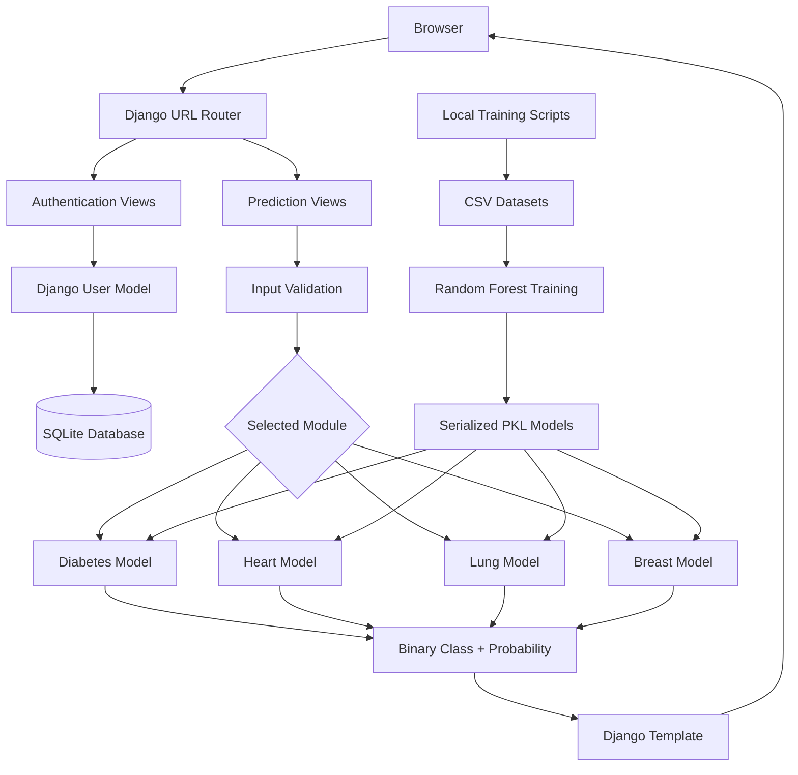

<div align="center">

# VitaPredica — Disease Prediction System

### A Django-based machine-learning web application for estimating the risk of diabetes, heart disease, lung cancer, and breast cancer.

[](https://www.python.org/)
[](https://www.djangoproject.com/)
[](https://scikit-learn.org/)
[](https://www.docker.com/)
[](https://diseasepredictionsystem-1475.onrender.com/)

[Live Demo](https://diseasepredictionsystem-1475.onrender.com/) · [Repository](https://github.com/vasmu01/DiseasePredictionSystem) · [Report an Issue](https://github.com/vasmu01/DiseasePredictionSystem/issues)

</div>

> [!IMPORTANT]
> This project is intended for education, research, and software demonstration only. Its predictions are not medical diagnoses and must not replace evaluation, testing, or treatment by a qualified healthcare professional.

---

## Table of Contents

- [Overview](#overview)
- [Key Features](#key-features)
- [Supported Predictions](#supported-predictions)
- [Technology Stack](#technology-stack)
- [Machine-Learning Design](#machine-learning-design)
- [System Architecture](#system-architecture)
- [Application Flow](#application-flow)
- [Project Structure](#project-structure)
- [URL Routes](#url-routes)
- [Getting Started](#getting-started)
- [Environment Variables](#environment-variables)
- [Google Sign-In Configuration](#google-sign-in-configuration)
- [Model Training and Replacement](#model-training-and-replacement)
- [Running with Docker](#running-with-docker)
- [Deployment on Render](#deployment-on-render)
- [Testing](#testing)
- [Troubleshooting](#troubleshooting)
- [Security and Privacy Notes](#security-and-privacy-notes)
- [Current Limitations](#current-limitations)
- [Suggested Roadmap](#suggested-roadmap)
- [Contributing](#contributing)
- [Author](#author)
- [License](#license)

---

## Overview

**VitaPredica** is a web-based health-risk prediction project built with Django and scikit-learn. It connects four independently trained binary-classification models to a browser-based interface where users can enter relevant clinical or lifestyle features and receive:

- A predicted positive or negative class
- An estimated positive-class probability
- The complementary negative-class probability
- Validation or model-loading error messages

The project also includes account registration, email-based login, logout, Django messages, optional Google authentication through `django-allauth`, static-file handling with WhiteNoise, Docker packaging, Gunicorn serving, and a Render Blueprint configuration.

The four trained model files are loaded once when Django imports the application views, reducing repeated model-loading work during individual prediction requests.

---

## Key Features

- Four independent disease-risk prediction modules
- Random Forest classification for every supported condition
- Probability-based prediction results
- Form validation and error handling
- Django user registration and authentication
- Email-based sign-in using Django's built-in `User` model
- Optional Google Sign-In through `django-allauth`
- Reusable Django template structure
- SQLite database for local development
- Pretrained models stored as serialized `.pkl` files
- Static-file collection and serving with WhiteNoise
- Production serving with Gunicorn
- Docker support
- Render deployment configuration
- Separate datasets and training scripts for model experimentation

---

## Supported Predictions

| Module | Input Features | Positive Class | Model File |
|---|---:|---|---|
| Diabetes | 8 | Diabetes risk detected | `diabetes_model.pkl` |
| Heart Disease | 13 | Heart-disease risk detected | `heart_model.pkl` |
| Lung Cancer | 15 | Lung-cancer risk detected | `lung_model.pkl` |
| Breast Cancer | 30 | Malignant classification | `breast_model.pkl` |

### 1. Diabetes Prediction

The diabetes model expects these features in the exact training order:

1. Pregnancies
2. Glucose
3. Blood pressure
4. Skin thickness
5. Insulin
6. BMI
7. Diabetes pedigree function
8. Age

The model returns a binary prediction, diabetes probability, and no-diabetes probability.

### 2. Heart-Disease Prediction

The heart-disease model uses 13 clinical features:

1. `age` — age in years
2. `sex` — encoded biological sex
3. `cp` — chest-pain type
4. `trestbps` — resting blood pressure
5. `chol` — serum cholesterol
6. `fbs` — fasting blood sugar indicator
7. `restecg` — resting ECG result
8. `thalach` — maximum heart rate achieved
9. `exang` — exercise-induced angina
10. `oldpeak` — ST depression induced by exercise
11. `slope` — slope of the peak exercise ST segment
12. `ca` — number of major vessels
13. `thal` — thalassemia-related encoded value

The model returns a heart-disease class and both positive and negative probability values.

### 3. Lung-Cancer Prediction

The lung-cancer model uses 15 demographic, lifestyle, and symptom features:

1. Gender
2. Age
3. Smoking
4. Yellow fingers
5. Anxiety
6. Peer pressure
7. Chronic disease
8. Fatigue
9. Allergy
10. Wheezing
11. Alcohol consumption
12. Coughing
13. Shortness of breath
14. Swallowing difficulty
15. Chest pain

Categorical values are represented numerically before prediction.

### 4. Breast-Cancer Prediction

The breast-cancer model uses 30 numerical tumor measurements divided into three groups.

#### Mean measurements

- Radius mean
- Texture mean
- Perimeter mean
- Area mean
- Smoothness mean
- Compactness mean
- Concavity mean
- Concave points mean
- Symmetry mean
- Fractal dimension mean

#### Standard-error measurements

- Radius SE
- Texture SE
- Perimeter SE
- Area SE
- Smoothness SE
- Compactness SE
- Concavity SE
- Concave points SE
- Symmetry SE
- Fractal dimension SE

#### Worst measurements

- Radius worst
- Texture worst
- Perimeter worst
- Area worst
- Smoothness worst
- Compactness worst
- Concavity worst
- Concave points worst
- Symmetry worst
- Fractal dimension worst

The positive class represents a malignant classification, while the negative class represents a benign classification.

---

## Technology Stack

### Backend

- Python 3.11
- Django 5.2.8
- Django authentication framework
- django-allauth 65.14.0
- Gunicorn 23.0.0
- WhiteNoise 6.11.0

### Machine Learning and Data Processing

- scikit-learn 1.8.0
- NumPy 2.3.5
- pandas 2.3.3
- SciPy 1.16.3
- joblib 1.5.2
- Matplotlib 3.10.8
- Seaborn 0.13.2
- Python `pickle` serialization

### Frontend

- Django templates
- HTML5
- CSS3
- JavaScript

### Database and Deployment

- SQLite
- Docker
- Gunicorn
- WhiteNoise
- Render Blueprint through `render.yaml`

---

## Machine-Learning Design

Each condition is handled by a separate `RandomForestClassifier` rather than one multi-disease model.

### Shared training configuration

The included scripts use the following primary configuration:

```python
RandomForestClassifier(
    n_estimators=100,
    max_depth=10,
    random_state=42,
    class_weight="balanced",
)
```

The datasets are divided using a stratified 80/20 train-test split:

```python
train_test_split(
    X,
    y,
    test_size=0.2,
    stratify=y,
    random_state=42,
)
```

### Dataset-specific preprocessing

#### Diabetes

- Reads `Localcode/diabetes.csv`
- Uses `Outcome` as the target
- Uses the remaining eight columns as features
- Trains a balanced Random Forest model

#### Heart disease

- Reads `Localcode/heart.csv`
- Replaces `?` values with missing values
- Converts columns to numerical values
- Removes rows containing missing values
- Uses `target` as the label
- Uses 13 explicitly ordered features
- Does not apply feature scaling

#### Lung cancer

- Reads `Localcode/lungcancer.csv`
- Maps `YES` to `1`, `NO` to `0`, `M` to `1`, and `F` to `0`
- Removes rows containing missing values
- Uses `Outcome` as the target

#### Breast cancer

- Reads `Localcode/breast-cancer.csv`
- Maps malignant (`M`) to `1` and benign (`B`) to `0`
- Removes the dataset's `id` column
- Uses 30 numerical measurements as model inputs

### Model evaluation

Every training script calculates training and testing accuracy with `accuracy_score`. Exact accuracy values are printed when the scripts are executed, but the repository does not currently store a reproducible evaluation report, confusion matrix, cross-validation result, precision, recall, F1 score, ROC-AUC score, or model card.

Because model performance depends on the exact dataset version and environment, accuracy values should be generated again and documented before presenting the project as clinically meaningful.

---

## System Architecture



---

## Application Flow

1. The user visits the home page.
2. The user selects one of the four prediction modules.
3. The browser submits the form using a POST request protected by Django CSRF middleware.
4. The related Django view reads and validates the submitted values.
5. Input values are placed into a NumPy array in the exact order expected by the model.
6. The corresponding pretrained `.pkl` model calls `predict()` and `predict_proba()`.
7. Django renders the result, probability, complementary probability, or an error message.
8. Prediction values are displayed to the user but are not currently saved as prediction-history records.

---

## Project Structure

```text
DiseasePredictionSystem/
├── Localcode/
│   ├── breast-cancer.csv
│   ├── breast.py
│   ├── breast_model.pkl
│   ├── checkcsv.py
│   ├── diabetes.csv
│   ├── diabetes_model.pkl
│   ├── diabeties.py
│   ├── heart.csv
│   ├── heart.py
│   ├── heart_model.pkl
│   ├── index.html
│   ├── lungcancer.csv
│   ├── lungcancer.py
│   └── lung_model.pkl
│
├── project_code/
│   ├── app/
│   │   ├── migrations/
│   │   ├── models/
│   │   │   ├── breast_model.pkl
│   │   │   ├── diabetes_model.pkl
│   │   │   ├── heart_model.pkl
│   │   │   └── lung_model.pkl
│   │   ├── static/
│   │   │   └── favicon.ico
│   │   ├── templates/
│   │   │   ├── base.html
│   │   │   ├── breastcancerprediction.html
│   │   │   ├── diabetiesprediction.html
│   │   │   ├── heartprediction.html
│   │   │   ├── home.html
│   │   │   ├── lungcancerprediction.html
│   │   │   ├── signin.html
│   │   │   └── signup.html
│   │   ├── admin.py
│   │   ├── apps.py
│   │   ├── models.py
│   │   ├── tests.py
│   │   ├── urls.py
│   │   └── views.py
│   ├── myproject/
│   │   ├── asgi.py
│   │   ├── settings.py
│   │   ├── urls.py
│   │   └── wsgi.py
│   ├── staticfiles/
│   └── manage.py
│
├── .dockerignore
├── .gitignore
├── Dockerfile
├── README.md
├── render.yaml
└── requirements.txt
```

### Important directories

- `Localcode/` contains the CSV datasets, standalone model-training scripts, and training-output model files.
- `project_code/app/models/` contains the model files loaded by the Django application.
- `project_code/app/templates/` contains all user-interface templates.
- `project_code/myproject/` contains the Django project settings, main routing, ASGI, and WSGI configuration.
- `project_code/staticfiles/` is generated by Django's `collectstatic` command and should normally be treated as build output.

---

## URL Routes

| Route | Name | Purpose |
|---|---|---|
| `/` | `home` | Home page and prediction-module selection |
| `/heartprediction/` | `heartprediction` | Heart-disease prediction form and result |
| `/lungcancerprediction/` | `lungcancerprediction` | Lung-cancer prediction form and result |
| `/breastcancerprediction/` | `breastcancerprediction` | Breast-cancer prediction form and result |
| `/diabetiesprediction/` | `diabetiesprediction` | Diabetes prediction form and result |
| `/signup/` | `signup` | User registration |
| `/signin/` | `signin` | Email/password login |
| `/logout/` | `logout` | User logout |
| `/admin/` | — | Django administration interface |
| `/accounts/` | — | django-allauth routes, including social authentication |

> [!NOTE]
> The code currently spells the diabetes route and several related identifiers as `diabeties`. Renaming these to `diabetes` would improve consistency, but every URL, view name, template name, and link must be updated together.

---

## Getting Started

### Prerequisites

Install the following software:

- Git
- Python 3.11 or a compatible version
- `pip`
- Python virtual-environment support

On Ubuntu or Debian-based Linux:

```bash
sudo apt update
sudo apt install git python3 python3-pip python3-venv -y
```

### 1. Clone the repository

```bash
git clone https://github.com/vasmu01/DiseasePredictionSystem.git
cd DiseasePredictionSystem
```

### 2. Create a virtual environment

```bash
python3 -m venv venv
```

### 3. Activate the virtual environment

#### Linux or macOS

```bash
source venv/bin/activate
```

#### Windows PowerShell

```powershell
venv\Scripts\Activate.ps1
```

#### Windows Command Prompt

```cmd
venv\Scripts\activate
```

### 4. Upgrade pip and install dependencies

```bash
python -m pip install --upgrade pip
pip install -r requirements.txt
```

### 5. Enter the Django project directory

```bash
cd project_code
```

### 6. Apply database migrations

```bash
python manage.py makemigrations
python manage.py migrate
```

`makemigrations` is only required when model definitions have changed. For a clean checkout with committed migration files, `python manage.py migrate` is normally sufficient.

### 7. Create an administrator account — optional

```bash
python manage.py createsuperuser
```

### 8. Start the development server

```bash
python manage.py runserver
```

Open the application at:

```text
http://127.0.0.1:8000/
```

To use a different port:

```bash
python manage.py runserver 8001
```

---

## Environment Variables

The project reads configuration directly from operating-system environment variables.

| Variable | Required | Default | Description |
|---|---|---|---|
| `SECRET_KEY` | Required in production | Insecure development fallback | Django cryptographic signing key |
| `DEBUG` | Recommended | `False` | Set to the exact string `True` to enable debug mode |
| `PORT` | Required by the Docker start command | Platform-dependent | Port used by Gunicorn |

### Linux or macOS example

```bash
export SECRET_KEY='replace-this-with-a-long-random-secret'
export DEBUG='True'
python manage.py runserver
```

### Production example

```bash
export SECRET_KEY='use-a-secure-random-production-key'
export DEBUG='False'
```

The repository ignores `.env`, but the application does not currently load `.env` files automatically. Add a package such as `python-dotenv` or `django-environ` before expecting Django to read a local `.env` file.

---

## Google Sign-In Configuration

Google authentication is enabled in `INSTALLED_APPS` through `django-allauth`, and `/accounts/` routes are included in the main URL configuration.

To use Google Sign-In:

1. Create OAuth credentials in Google Cloud Console.
2. Add the correct local and deployed callback URLs to the OAuth client.
3. Run migrations.
4. Create or update the Django `Site` record in `/admin/`.
5. Add a Google Social Application in Django admin.
6. Enter the Google client ID and client secret.
7. Attach the Social Application to the correct Site.

Typical local callback URL:

```text
http://127.0.0.1:8000/accounts/google/login/callback/
```

Use HTTPS for the deployed callback URL.

Never commit Google client secrets or downloaded OAuth credential files. The repository already ignores files matching `client_secret*.json`.

---

## Model Training and Replacement

The Django application uses the model files inside:

```text
project_code/app/models/
```

The training scripts and source datasets are located in:

```text
Localcode/
```

### Train the diabetes model

```bash
cd Localcode
python diabeties.py
```

### Train the heart-disease model

```bash
python heart.py
```

### Train the lung-cancer model

```bash
python lungcancer.py
```

### Train the breast-cancer model

```bash
python breast.py
```

The scripts save `.pkl` files in `Localcode/`. Copy newly generated files into the Django model directory:

```bash
cp diabetes_model.pkl ../project_code/app/models/
cp heart_model.pkl ../project_code/app/models/
cp lung_model.pkl ../project_code/app/models/
cp breast_model.pkl ../project_code/app/models/
```

Restart Django or Gunicorn after replacing model files because the models are loaded at module-import time.

> [!WARNING]
> The current training scripts continue into an interactive command-line prediction prompt after training. Refactoring each script into separate `train()` and `predict_cli()` functions would make retraining easier to automate.

### Model compatibility

Pickled scikit-learn models can fail when loaded with an incompatible Python, NumPy, or scikit-learn version. Keep the training and serving environments aligned with `requirements.txt`, or export a reproducible model package containing:

- Library versions
- Feature names and order
- Target mapping
- Training date
- Dataset checksum or version
- Evaluation metrics
- Model hyperparameters

---

## Running with Docker

### 1. Build the image

Run this command from the repository root:

```bash
docker build -t vitapredica .
```

### 2. Run the application

The following command applies migrations and then starts Gunicorn:

```bash
docker run --rm \
  -p 8000:8000 \
  -e PORT=8000 \
  -e SECRET_KEY='replace-with-a-secure-key' \
  -e DEBUG='False' \
  vitapredica \
  sh -c "python manage.py migrate && gunicorn myproject.wsgi:application --bind 0.0.0.0:8000"
```

Open:

```text
http://127.0.0.1:8000/
```

### Current Docker behavior

The repository's Dockerfile:

1. Uses `python:3.11-slim`
2. Installs `requirements.txt`
3. Copies the repository
4. Changes the working directory to `/app/project_code`
5. Runs `collectstatic`
6. Exposes port `8000`
7. Starts Gunicorn using the platform-provided `$PORT`

The current Dockerfile does not automatically run database migrations. A production startup script or entrypoint should run migrations safely before Gunicorn starts.

SQLite data inside a disposable container is not durable unless the database file is stored on persistent storage. For production, use a managed PostgreSQL database and a proper `DATABASE_URL` configuration.

---

## Deployment on Render

### Live Application

The deployed application is available at:

**[https://diseasepredictionsystem-1475.onrender.com/](https://diseasepredictionsystem-1475.onrender.com/)**

> Render free-tier services may take a short time to wake up after a period of inactivity.

The included `render.yaml` defines a free Docker web service named:

```text
disease-prediction-system
```

It uses:

- Docker runtime
- Root-level `Dockerfile`
- `SECRET_KEY` as a manually configured secret
- `DEBUG=False`

### Deployment steps

1. Push the latest project code to GitHub.
2. Sign in to Render.
3. Create a new Blueprint or Web Service from the repository.
4. Allow Render to detect `render.yaml`.
5. Set a strong `SECRET_KEY` in the Render environment settings.
6. Confirm `DEBUG` is `False`.
7. Configure Google OAuth credentials and callback URLs if social login is required.
8. Ensure database migrations run during deployment or startup.
9. Verify static files and all four model files are present in the built image.

### Recommended production improvements

- Replace SQLite with PostgreSQL.
- Restrict `ALLOWED_HOSTS` to the deployed hostname.
- Add `CSRF_TRUSTED_ORIGINS` for the HTTPS deployment URL.
- Run `python manage.py check --deploy`.
- Add a release or startup command for migrations.
- Store secrets only in Render environment variables.
- Configure structured application logging.
- Add health checks.

---

## Testing

Run Django's test command from `project_code/`:

```bash
python manage.py test
```

The current `tests.py` file contains no implemented test cases. Recommended tests include:

- Signup with valid and duplicate usernames
- Login with valid and invalid credentials
- Logout behavior
- CSRF protection
- GET response for every page
- Valid prediction submission for every model
- Missing and invalid form values
- Missing or incompatible model files
- Correct feature ordering
- Probability range validation
- Authentication and authorization rules
- Static-file collection
- Docker build and application startup

---

## Troubleshooting

### `The directory .../project_code/static does not exist`

`STATICFILES_DIRS` points to `project_code/static`, while the repository's application static file is under `project_code/app/static`.

Choose one solution:

```bash
mkdir -p project_code/static
```

Or remove the extra `STATICFILES_DIRS` entry if all static assets are stored inside application-level `static/` directories.

### `no such table: auth_user` or `no such table: django_session`

Run migrations:

```bash
cd project_code
python manage.py migrate
```

### `Model not loaded`

Confirm all files exist:

```bash
ls -lh project_code/app/models/
```

Expected files:

```text
breast_model.pkl
diabetes_model.pkl
heart_model.pkl
lung_model.pkl
```

Also confirm that the installed scikit-learn version is compatible with the version used to serialize the models.

### `That port is already in use`

Use another port:

```bash
python manage.py runserver 8001
```

Or identify the process using port 8000:

```bash
sudo lsof -i :8000
```

### Google login fails

Check:

- Google OAuth client ID and secret
- Django Site domain
- Social Application site association
- Authorized redirect URI
- HTTPS configuration in production
- `/accounts/` URL inclusion

### Static files fail in production

Run:

```bash
python manage.py collectstatic --noinput
```

Confirm WhiteNoise is installed and its middleware is active.

### Render starts but authentication fails

Make sure migrations have been applied. The current Dockerfile collects static files but does not run `migrate` automatically.

---

## Security and Privacy Notes

- The application uses Django's built-in `User` model for the active signup and login flow.
- Passwords created through `User.objects.create_user()` are hashed by Django.
- A legacy `Data` model also exists with `password` and `cpassword` character fields. It is not used by the current authentication views and should not be used to store credentials. Remove or redesign it before future development.
- The current settings include an insecure fallback `SECRET_KEY`; production must provide a secure environment variable.
- `ALLOWED_HOSTS = ["*"]` is convenient during development but should be restricted in production.
- The application does not currently show evidence of encrypted patient-record storage, formal compliance auditing, or HIPAA certification.
- Prediction inputs and outputs are not saved by the current prediction views, but authentication and session data are stored in the configured database.
- Avoid entering real personally identifiable medical information into a public demo.
- Only load trusted `.pkl` files. Python pickle files can execute arbitrary code during deserialization.
- Add rate limiting, secure cookies, HTTPS enforcement, logging, monitoring, and stronger deployment settings before exposing the application publicly.

---

## Current Limitations

- Supports four prediction modules, not a general diagnosis system
- Uses binary classification rather than differential diagnosis
- No clinical validation
- No model explainability such as SHAP or feature contributions
- No saved prediction history
- No REST API
- No comprehensive automated tests
- No stored evaluation report or model card
- No documented dataset source or license
- No cross-validation or external validation documented
- No input-range validation based on medically plausible limits
- No model/version registry
- SQLite is used by default
- Production host and CSRF settings are not fully hardened
- The diabetes-related code uses the misspelling `diabeties`
- Some user-interface claims should be reviewed so they match the actual four-model capability
- The training scripts mix model training with interactive terminal prediction
- The legacy `Data` model contains unsuitable plain character fields for passwords

---

## Suggested Roadmap

- [ ] Correct `diabeties` naming throughout the project
- [ ] Add medically appropriate input ranges and units
- [ ] Add Django forms instead of reading raw POST values directly
- [ ] Add prediction history linked to authenticated users
- [ ] Add PostgreSQL support through environment configuration
- [ ] Add REST API endpoints with Django REST Framework
- [ ] Add automated tests and CI with GitHub Actions
- [ ] Record precision, recall, F1, ROC-AUC, and confusion matrices
- [ ] Add cross-validation and external validation
- [ ] Add model cards and dataset documentation
- [ ] Add explainability with SHAP or feature-importance visualizations
- [ ] Split training and CLI prediction into separate functions
- [ ] Add a migration-aware Docker entrypoint
- [ ] Restrict production security settings
- [ ] Add screenshots and a verified live-demo URL
- [ ] Add a project license

---

## Contributing

Contributions are welcome for educational improvement.

1. Fork the repository.
2. Create a feature branch:

   ```bash
   git checkout -b feature/your-feature-name
   ```

3. Make and test your changes.
4. Commit using a clear message:

   ```bash
   git commit -m "Add: description of the improvement"
   ```

5. Push the branch:

   ```bash
   git push origin feature/your-feature-name
   ```

6. Open a pull request describing the change, test results, and any effect on model inputs or outputs.

For machine-learning changes, include the dataset version, preprocessing steps, feature order, evaluation metrics, and generated model compatibility information.

---

## Author

**Kiran Magar**

- GitHub: [@vasmu01](https://github.com/vasmu01)
- Repository: [DiseasePredictionSystem](https://github.com/vasmu01/DiseasePredictionSystem)

---

## License

This repository does not currently include a dedicated `LICENSE` file. Add an appropriate license before inviting reuse, distribution, or modification by others.

---

<div align="center">

Built for learning and demonstrating the integration of Django web development with machine-learning classification.

**Always consult a qualified healthcare professional for medical concerns.**

</div>
